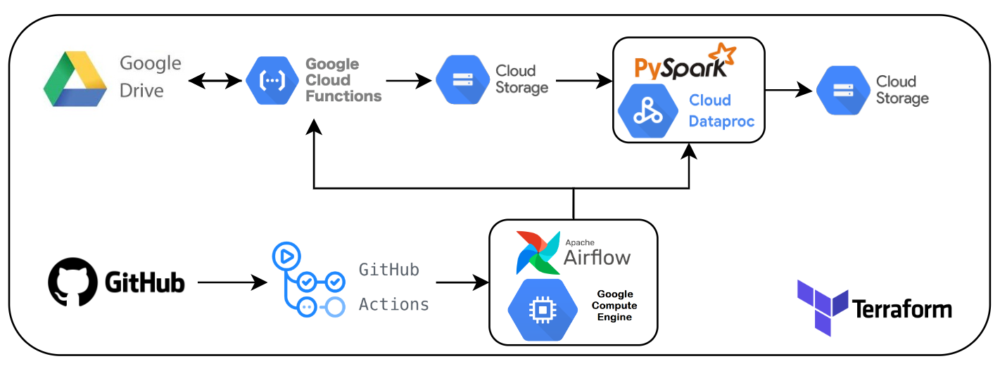

# Projeto de Engenharia de Dados: Pipeline Batch com uso do Spark através do DataProc do GCP

## Introdução

O Google Cloud Dataproc é um serviço gerenciado na nuvem da Google que possibilita a rápida e eficiente execução de scripts Spark. Este projeto tem como objetivo o desenvolvimento completo de uma pipeline, que tem origem em dados armazenados no Google Drive, os quais são processados pelo Dataproc. Além disso, o projeto envolve a configuração do Airflow para a orquestração dessa pipeline, juntamente com o uso do GitHub Actions para a criação de esteiras de CI/CD. 

## Tecnologias Utilizadas

- **Compute Engine:** máquina virtual na qual será executado o Airflow.
- **GitHub Action:** plataforma de automação integrada que copiará os dados do repositório github para o diretório da Compute Engine.   
- **Terraform:** ferramenta que permite o provisionamento eficiente de toda a infraestrutura necessária, seguindo a metodologia de Infraestrutura como Código (IaC). 
- **Cloud Function** ambiente na nuvem que executará a parte de ingestão do código Python, fornecendo escalabilidade e flexibilidade. 
- **Airflow:** ferramenta open-source de orquestração de pipelines.
- **Pyspark:** framework de Big Data utilizado para realizar a etapa de processamento dos dados.
- **Google Drive:** serviço de armazenamento em nuvem oferecido pelo Google para armazenar, compartilhar e sincronizar arquivos e documentos online.
- **DataProc:** serviço de gerenciamento de clusters de computação para processamento de dados em grande escala, ambiente no qual sera executado o código spark.
- **Cloud Storage:** serviço da nuvem que será responsável pelo armazenamento dos dados.
  

 

  
  
  
  

## Arquitetura

## Etapas do Projeto

### 1. Configurações Iniciais para o Uso da API do Google Drive

Como os dados têm origem em arquivos disponíveis exclusivamente no Google Drive, são necessárias configurações iniciais para o uso da API. Isso envolve a habilitação da API no projeto do GCP, além da criação de um usuário de teste na tela de permissão OAuth. O procedimento detalhado está descrito na documentação da Google, acessível através do link: https://developers.google.com/drive/api/quickstart/python?hl=pt-br. Com a API configurada corretamente e utilizando a biblioteca Google para interação, foi criada a classe [GoogleDrive](src/classes/google_drive.py) capaz de manipular os arquivos do Google Drive, permitindo listar, baixar e fazer upload de arquivos. 

### 2. Desenvolvimento do Script da Cloud Function para a Etapa de Ingestão da Pipeline

Com a API do Google Drive funcional, inicia-se o desenvolvimento da primeira parte da pipeline, que consiste na ingestão dos dados. Isso envolve a cópia dos dados do Google Drive para um bucket do Cloud Storage. Foi desenvolvido um script Python que consulta um arquivo contendo a última data de criação dos arquivos do Drive e, a cada execução, verifica e armazena os novos documentos criados. Este script localizado na pasta [src](src/), por sua simplicidade, não requer o uso de bibliotecas de big data, como Spark, e será executado como uma Cloud Function, seguindo boas práticas de infraestrutura como código, com o uso do Terraform. 

### 3. Desenvolvimento do Script de Processamento em Spark para Utilização no Dataproc

Com a etapa de ingestão finalizada e os arquivos CSVs disponíveis no Cloud Storage, é o momento de realizar o processamento e tratamento desses dados através do Spark. Foi desenvolvido um script Spark capaz de transformar e tratar os arquivos CSVs conforme necessário. Com o script pronto [spark_final](dags/spark_final.py), foram realizados testes na execução deste script como um job batch no Dataproc, uma solução gerenciada que dispensa a necessidade de provisionamento de infraestrutura e configuração de clusters. 

### 4. Configuração da Instância e Instalação do Airflow para o Agendamento e Orquestração da Pipeline

Com os scripts prontos, será configurado um ambiente capaz de orquestrar a execução das etapas anteriores diariamente. Será criada uma máquina virtual que, através do Docker, executará um container contendo o Airflow. Através do Airflow, serão criados DAGs que executarão a Cloud Function e posteriormente o job no Dataproc. 

### 5. Desenvolvimento do Script das DAGs

Com o Airflow configurado e funcionando corretamente, será criada uma DAG contendo duas tarefas: a primeira executará a Cloud Function e a segunda executará o job no Dataproc. 

### 6. Configuração do GitHub Actions para Criação de Esteiras de CI/CD

Para evitar a necessidade de copiar toda a DAG para a instância, será configurado o GitHub Actions, de modo que, a cada commit em um repositório do GitHub, ocorra um SSH na máquina virtual, copiando os códigos atualizados para dentro da instância, mantendo assim os dados da DAG atualizados. 

## Pré-Requisitos

Antes de prosseguir com este projeto, é necessário ter o Terraform instalado na maquina, alem de um conta no GCP com chave json no arquivo raiz chamado de gcp_account.json.

## Executando o Projeto

Siga os passos abaixo para executar este projeto:
1. Copie o diretório do projeto para uma pasta local em seu computador.
2. Execute o terraform dentro da pasta build/cloud_function  `terraform init terraform plan terraform apply`
3. Execute o terraform dentro da pasta build/compute engine  `terraform init terraform plan terraform apply`

